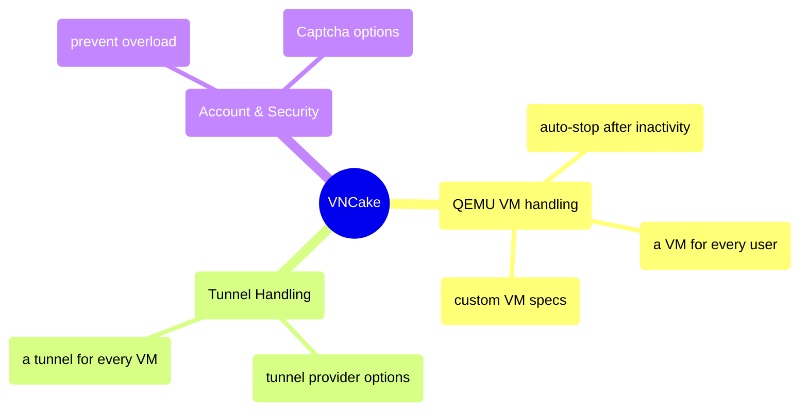

# VNCake

VNCake is an open-source program, to host your distrubution, or almost any operating system easily.

Imagine  [DistroSea](https://distrosea.com/), but open sourced and you can self-host it.

With GUI and CLI options, it only takes a few clicks to deploy your VNCake server! 

# Navigation

- [Features](#features)
- [Quickstart](#quickstart)
- [How to host?](#how-to-host)
- [Future Plans](#future-plans)
- [Contact](#contact)
- [Support](#support)

# Features

**CLI / GUI:** Make your settings, check your logs and host easily!

**Tunneling:** VNCake uses [Tunnelify](https://github.com/MYusufY/tunnelify) library to be able to create [Cloudflare](https://github.com/cloudflare/cloudflared) or [Localtunnel](https://github.com/localtunnel/localtunnel) tunnels for every VM. You can choose between Cloudflare and Localtunnel, and choose a custom subdomain for your project! (only on localtunnel)
 - **Why?**
	 - Cloudflare is stable and fits better to long-time connection use-cases.
		 - Pros:
			 - (more) Stable.
			 - Less downtime.
			 - Faster.
		 - Cons:
			 - Deploys slow (takes around 1-2 minutes!)
			 - Longer domain name.
			 - Cant customize the subdomain.
		 - Examples:
			 - Self-hosting VNCake and accessing your VMs anywhere, reliably.
	 - Localtunnel is fast and fits better to quick-deploy (and access) to VM.
		 - Pros:
			 - Quick deploy (around 3 seconds, you can access your VM right away!)
			 - Custom subdomains for every VM. (`https://thecustomsubdomainyouchoose-randomcodeforeveryVM.loca.ly`)
			 - Shorter domain name. (`loca.ly`)
		 - Cons:
			 - Less stable than Cloudflare
			 - Can be down sometimes (not common!)
			 - Requires a secret code before being able to open VNC screen. (code is special for your VM, [learn more here.](https://github.com/localtunnel/localtunnel/issues/598))
		- Examples:
			- Quick access to VNC screen on Linux distribution websites. (Try-on-browser feature)
				- [AgenticArch Linux (soon)](https://agenticarch.tachion.tech/)
				- [AgenticCore Linux (soon)](https://agenticcore.tachion.tech/)

**Captcha Option:** You can set Captcha image validation in one click, to protect your VPS!
**Customizable Frontend:** With the help of [Flask templates](https://flask.palletsprojects.com/en/stable/tutorial/templates/), you can edit the login, signup and dashboard front-ends easily!
**Account System:** Thanks to accounts, everyone has their own VM environments, and your VPS is being protected from overload!
**Easy to host:** Online in one line.

# Quickstart
1. Basics
	- Set ISO path to be hosted and noVNC client path.
	**CLI**
	`vncake --cli --iso-path /path/to/custom.iso` -> Will host this ISO.
	`vncake --cli --novnc-path /opt/noVNC` -> Will use this noVNC.
	**GUI**
	
2. Enable Captcha
	- When enabled, it will verify that the user is a human
	- This does not effect the account system; email and password is still required.
	**CLI**
			`vncake --cli --captcha` -> Enable Captcha
			`vncake --cli --no-captcha` -> Disable Captcha
	**GUI**
	

3. Enable Tunneling
	- When enabled, it will host the VNC-viewers of the specific VMs using the tunnel provider you selected.
		- Tunnel Providers:
			- Cloudflare - stable
			- Localtunnel - fast (for deploying)
	- If you dont activate this, your VMs will only be accesible for you, on localhost.
	**CLI**
		`vncake --cli --tunneling` -> Activate tunneling
		`vncake --cli --tunneling --tunnel-provider cloudflare` -> Use cloudflare as tunnel provider
		`vncake --cli --tunneling --tunnel-provider localtunnel` -> Use localtunnel as tunnel provider
		`vncake --cli --tunneling --tunnel-provider localtunnel --localtunnel-subdomain myvms` -> Use localtunnel as tunnel provider with custom subdomain
		`vncake --cli --no-tunneling` -> Disable tunneling
	**GUI**
	
4. VM Settings
	- You can customize the timeout-time and QEMU VM resources.
	**CLI**
	`vncake --cli --memory 8192 --cpus 8` -> Set custom memory and CPUs
	`vncake --cli --timeout 1800` -> Set custom timeout (as seconds)
	**GUI**
	
5. Network / Port Configuration
	- You can set port and VNC port start points.
	**CLI**
	`vncake --cli --port-start 6000 --vnc-port-start 7000` -> Normal port start 6000, VNC port start 7000.
	`vncake --cli --host 192.168.1.100 --port 8080` -> Custom host & port.
	**GUI**
	
6. Help!
	**CLI**
		- General help:
			`vncake --help`
		- CLI help:
			`vncake --cli --help`

# Notes

-   The  `--cli`  flag is required to run in command-line mode.
-   Tunneling requires the  `tunnelify`  package to be installed.
-   Make sure the ISO file and noVNC directory paths are correct.    
-   Use  `--debug`  flag for more verbose output during development.

# How to host?
1. You can use any VPS service or your own VPS to host a VNCake server.
If you're using a server without a DE (in most cases), you can follow the guides [above](#quickstart) to host with VNCake in CLI.

## What VNCake does?

2. VNCake Dashboard will be started on localhost. You can test it locally, but you need to host at the end, to make it accesible everywhere :) To do that, you can use tunneling (seperate from VM tunnels) or any other method.
	VNCake only tunnels VMs (if activated). So it will not tunnel "itself". You should do it manually!
	Basically, you can try or test it with:
	`lt --port 5000 --subdomain myvncakeserver`
	But for more stability and using your own domain, you can use [Cloudflared](https://github.com/cloudflare/cloudflared).

# Future Plans

- [ ] Self-tunneling
- [ ] Multi-OS (ISO) option.
- [ ] Improved README
- [ ] Deploy in a package manager

# Contact

You can contact me using [yusuf@tachion.tech](mailto:yusuf@tachion.tech)

# Support

You can support me using ["Buy Me A Coffee"](https://buymeacoffee.com/myusuf)!
